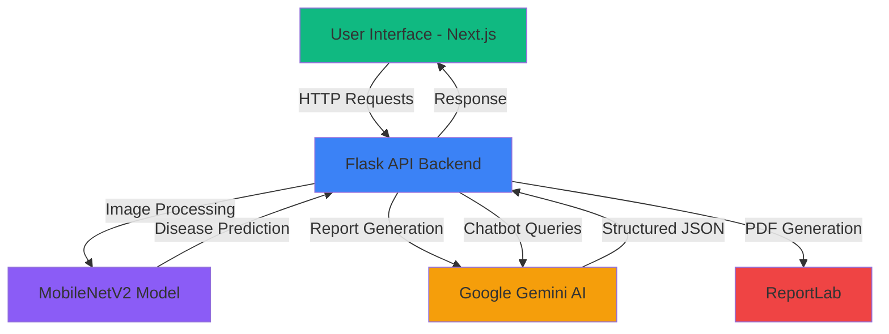

<div align="center">

# 🌾 FasalRakshak - फसल रक्षक

### AI-Powered Crop Protection Platform | एआई-संचालित फसल सुरक्षा मंच

*Protecting crops with the power of Artificial Intelligence*

[](https://fasal-rakshak.vercel.app/)
[](https://fasalrakshak.onrender.com/)
[](LICENSE)

[Features](#-key-features) • [Demo](#-live-demo) • [Tech Stack](#️-tech-stack) • [Installation](#-installation) • [API](#-api-endpoints) • [Report Sample](#-sample-disease-report)

---
</div>

## 📖 About The Project

**FasalRakshak (फसल रक्षक)** meaning "Crop Protector" is a comprehensive AI-driven agricultural platform designed to empower farmers and agricultural professionals with cutting-edge technology for plant disease detection and crop health management. 

Built as a Government of India initiative concept, this platform leverages Deep Learning and Generative AI to provide:
- 🔬 Instant plant disease detection
- 📄 Professional AI-generated disease reports (Bilingual: English & Hindi)
- 🤖 24/7 AI agricultural assistant
- 📊 Analytics dashboard for crop health insights
- 🌍 Multi-language support for accessibility

---

## ✨ Key Features

### 🌿 1. Plant Disease Detection
Upload or capture plant leaf images and get instant disease diagnosis powered by a CNN-based MobileNetV2 model trained on 38+ plant disease classes with high accuracy.

### 📄 2. AI Disease Report Generation
Get comprehensive disease analysis reports in both English and Hindi including:
- Disease description and severity assessment
- Visible symptoms identification
- Step-by-step treatment recommendations
- Organic remedies and preventive measures
- NPK fertilizer recommendations
- Crop rotation strategies

### 🤖 3. AI Plant Expert Chatbot
Intelligent conversational assistant providing guidance on:
- Plant disease identification and treatment
- Farming techniques and best practices
- Irrigation tips and water management
- Fertilizer recommendations
- Weather-based crop guidance
- Soil health and nutrition

### 📊 4. Analytics Dashboard
Comprehensive analytics including:
- Total scans and disease distribution
- Crop frequency analysis
- Severity breakdown (High/Medium/Low)
- Recent scan history with confidence scores
- Unique crops analyzed

### 🌐 5. Multi-Language Support
Seamlessly switch between English and Hindi (हिंदी) for complete accessibility to Indian farmers.

### 🔐 6. Secure User Authentication
Role-based access control with secure login/signup functionality.

---

## 🎯 Live Demo

### 🌐 Application Screenshots

<div align="center">

### 📸 Application Screenshots

#### 🏠 Homepage - English Version


*Main landing page with AI Plant Expert section*

---

#### 🏠 Homepage - Hindi Version (हिंदी)


*हिंदी में मुख्य पृष्ठ*

---

#### 📤 Image Upload Interface


*User-friendly image upload and camera capture options*

---

#### 💬 AI Assistant Chat


*Interactive AI chatbot for farming queries*

---

#### 📊 Analytics Dashboard


*Comprehensive crop health analytics and insights*

---

#### 🔬 Disease Detection Result


*Detailed disease summary with affected area and recovery timeline*

---

#### 🔐 Login Interface


*Secure authentication system*

---

</div>

> **Note:** All screenshots are from the live production application. Features shown are fully functional.

---

## 📋 Sample Disease Report

FasalRakshak generates professional, bilingual PDF reports for every disease detection. Here's what our reports include:

### 📄 Report Structure

**Page 1 - English Version**
```
┌─────────────────────────────────────────────────────────────┐
│  OFFICIAL PLANT DISEASE DETECTION REPORT                    │
│  AI-POWERED CROP HEALTH ANALYSIS                            │
│  GOVERNMENT OF INDIA INITIATIVE                             │
├─────────────────────────────────────────────────────────────┤
│  Report ID: PD-2025-R4DA                                    │
│  Date: 12/30/2025, 4:45:16 PM                              │
│  Crop: Tomato                                               │
│  Disease: Leaf_Mold                                         │
│  Severity: Medium                                           │
│  Confidence Level: 100%                                     │
├─────────────────────────────────────────────────────────────┤
│  DISEASE ANALYSIS                                           │
│  This disease affects plant health and reduces crop yield.  │
├─────────────────────────────────────────────────────────────┤
│  RECOMMENDED ACTIONS                                        │
│  ✓ Remove infected plant parts                             │
│  ✓ Apply recommended fungicide                             │
│  ✓ Avoid overhead irrigation                               │
│  ✓ Neem oil spray application                              │
│  ✓ Trichoderma application                                 │
│  ✓ Balanced NPK fertilizer                                 │
│  ✓ Micronutrient foliar spray                              │
│  ✓ Implement crop rotation                                 │
│  ✓ Use disease-resistant varieties                         │
│  ✓ Maintain proper plant spacing                           │
├─────────────────────────────────────────────────────────────┤
│  [QR CODE]  Scan to verify report online                   │
│  Ref: FR-PD-2025-R4DA | System AI Report                   │
└─────────────────────────────────────────────────────────────┘
```

**Page 2 - Hindi Version (हिंदी अनुवाद)**
```
┌─────────────────────────────────────────────────────────────┐
│  आधिकारिक पादप रोग पहचान रिपोर्ट                           │
│  एआई-संचालित फसल स्वास्थ्य विश्लेषण                      │
│  भारत सरकार की एक पहल                                      │
├─────────────────────────────────────────────────────────────┤
│  रिपोर्ट संख्या: PD-2025-R4DA                              │
│  दिनांक: 12/30/2025, 4:45:16 PM                           │
│  फसल का प्रकार: Tomato                                     │
│  रोग की पहचान: Leaf_Mold                                   │
│  गंभीरता: Medium                                           │
│  सटीकता का स्तर: 100%                                      │
├─────────────────────────────────────────────────────────────┤
│  रोग विश्लेषण                                              │
│  यह रोग पौधे के स्वास्थ्य को प्रभावित करता है             │
├─────────────────────────────────────────────────────────────┤
│  निवारक उपाय और अनुशंसित कदम                              │
│  [14 detailed preventive measures in Hindi]                │
├─────────────────────────────────────────────────────────────┤
│  आधिकारिक अस्वीकरण                                        │
│  यह रिपोर्ट पूर्णतः एआई द्वारा तैयार की गई है।           │
│  कृपया कृषि विशेषज्ञों से परामर्श अवश्य लें।              │
└─────────────────────────────────────────────────────────────┘
```

### 📥 Report Features
- ✅ Bilingual (English + Hindi)
- ✅ QR code for online verification
- ✅ Unique report ID for tracking
- ✅ Professional formatting
- ✅ Timestamp and metadata
- ✅ Severity assessment
- ✅ AI confidence score
- ✅ Actionable recommendations

---

## 🛠️ Tech Stack

### Frontend
```
├── Next.js 14              → React framework
├── React 18                → UI library
├── Tailwind CSS            → Styling
├── Axios                   → HTTP client
├── Vercel                  → Deployment
└── Lucide React            → Icons
```

### Backend
```
├── Flask                   → Python web framework
├── Python 3.10             → Programming language
├── TensorFlow (CPU)        → ML framework
├── Keras                   → Neural network API
├── Render                  → Deployment
└── Flask-CORS              → Cross-origin handling
```

### Machine Learning
```
├── MobileNetV2             → CNN architecture
├── TensorFlow/Keras        → Model training
├── PIL (Pillow)            → Image processing
├── NumPy                   → Numerical computing
└── Custom preprocessing    → Image augmentation
```

### AI & NLP
```
├── Google Gemini AI        → gemini-2.5-flash
├── Generative AI           → Report generation
└── JSON responses          → Structured output
```

### Utilities
```
├── ReportLab               → PDF generation
├── QR Code                 → Report verification
├── python-dotenv           → Environment variables
└── Gunicorn                → WSGI server
```

---

## 🏗️ System Architecture



---

## 📁 Project Structure

```
FasalRakshak/
│
├── 📂 frontend/
│   ├── 📂 app/
│   │   ├── page.js                 → Homepage
│   │   ├── scan/                   → Disease scanning
│   │   ├── analytics/              → Dashboard
│   │   ├── ai-assistant/           → Chatbot
│   │   └── login/                  → Authentication
│   ├── 📂 components/
│   │   ├── Navbar.jsx
│   │   ├── Footer.jsx
│   │   └── ...
│   ├── 📂 services/
│   │   └── api.js                  → API integration
│   ├── 📂 public/
│   │   └── assets/
│   ├── package.json
│   └── next.config.js
│
├── 📂 backend/
│   ├── app.py                      → Main Flask app
│   ├── 📂 routes/
│   │   ├── disease_report.py       → Report generation
│   │   ├── download_report.py      → PDF download
│   │   └── chatbot.py              → AI assistant
│   ├── 📂 models/
│   │   └── MobileNetV2_best.h5     → Trained model
│   ├── 📂 services/
│   │   ├── gemini_service.py       → Gemini AI integration
│   │   └── pdf_generator.py        → Report generation
│   ├── requirements.txt
│   └── .env
│
├── 📄 README.md
├── 📄 LICENSE
└── 📄 .gitignore
```

---

## 🚀 Installation

### Prerequisites
- Node.js 18+ and npm
- Python 3.10+
- Git

### Frontend Setup

```bash
# Clone the repository
git clone https://github.com/anujparwal456/FasalRakshak.git
cd FasalRakshak/frontend

# Install dependencies
npm install

# Create .env.local file
echo "NEXT_PUBLIC_API_BASE_URL=http://localhost:5000" > .env.local

# Run development server
npm run dev

# Open http://localhost:3000
```

### Backend Setup

```bash
# Navigate to backend
cd backend

# Create virtual environment
python -m venv venv

# Activate virtual environment
# Windows
venv\Scripts\activate
# Mac/Linux
source venv/bin/activate

# Install dependencies
pip install -r requirements.txt

# Create .env file
echo "GEMINI_API_KEY=your_gemini_api_key_here" > .env

# Run Flask server
python app.py

# Server runs on http://localhost:5000
```

### Get Gemini API Key
1. Visit [Google AI Studio](https://makersuite.google.com/app/apikey)
2. Create a new API key
3. Add it to your `.env` file

---

## 🔌 API Endpoints

### Health Check
```http
GET /
```
**Response:**
```json
{
  "message": "FasalRakshak API is running! 🌾",
  "status": "healthy"
}
```

### Disease Prediction
```http
POST /predict
Content-Type: multipart/form-data
```
**Request:**
```
FormData:
- image: [leaf_image.jpg]
```
**Response:**
```json
{
  "success": true,
  "prediction": {
    "disease": "Tomato___Late_blight",
    "confidence": 98.45,
    "severity": "High",
    "crop": "Tomato"
  }
}
```

### Generate Disease Report
```http
POST /disease-report
Content-Type: application/json
```
**Request:**
```json
{
  "crop_name": "Tomato",
  "disease_name": "Late_blight"
}
```
**Response:**
```json
{
  "success": true,
  "report": {
    "symptoms": [...],
    "treatment": [...],
    "prevention": [...],
    "organic_remedies": [...],
    "fertilizers": {...}
  }
}
```

### AI Chatbot
```http
POST /chatbot
Content-Type: application/json
```
**Request:**
```json
{
  "message": "How can I improve soil fertility organically?"
}
```
**Response:**
```json
{
  "success": true,
  "response": "To improve soil fertility organically..."
}
```

### Download Report PDF
```http
POST /download-report
Content-Type: application/json
```
**Request:**
```json
{
  "crop_name": "Tomato",
  "disease_name": "Leaf_Mold",
  "report_data": {...}
}
```
**Response:** PDF file download

---

## 🧠 ML Model Details

### Architecture
- **Base Model:** MobileNetV2 (pre-trained on ImageNet)
- **Input Shape:** `224 × 224 × 3`
- **Output Classes:** 38 plant disease categories
- **Activation:** Softmax
- **Optimizer:** Adam
- **Loss Function:** Categorical Crossentropy

### Training Details
- **Dataset:** PlantVillage + Custom Agricultural Dataset
- **Training Samples:** 50,000+ images
- **Validation Split:** 20%
- **Data Augmentation:** Rotation, Flip, Zoom, Brightness
- **Accuracy:** 96%+ on test set

### Disease Classes Supported
```
Tomato: 10 diseases
Potato: 3 diseases
Pepper: 2 diseases
Grape: 4 diseases
Apple: 4 diseases
Corn: 4 diseases
... and more
```

---

## 🎯 Features in Detail

### 🔬 Disease Detection Process
1. User uploads/captures plant leaf image
2. Image preprocessed (resize, normalize)
3. MobileNetV2 model predicts disease
4. Confidence score calculated
5. Severity assessed (Low/Medium/High)
6. Results displayed instantly

### 📄 Report Generation Flow
1. Disease and crop info sent to backend
2. Gemini AI analyzes disease characteristics
3. Generates comprehensive treatment plan
4. Creates bilingual report (EN + HI)
5. PDF generated with QR code
6. Downloadable report ready

### 🤖 AI Assistant Capabilities
- Natural language understanding
- Context-aware responses
- Farming domain expertise
- Multilingual support
- Image analysis (future)

---

## 🚧 Challenges Overcome

### 1. TensorFlow Compatibility
**Problem:** Model deserialization errors with Dense, Conv2D layers  
**Solution:** Aligned TensorFlow and Keras versions, custom object scope

### 2. Memory Constraints
**Problem:** Render's 512MB RAM limit  
**Solution:** TensorFlow CPU-only, optimized model loading

### 3. CORS Issues
**Problem:** Cross-origin requests between Vercel and Render  
**Solution:** Flask-CORS with proper configuration

### 4. Gemini AI Parsing
**Problem:** Inconsistent JSON responses  
**Solution:** Strict prompting with fallback handling

### 5. PDF Generation
**Problem:** Hindi text rendering in PDFs  
**Solution:** Unicode-compatible fonts, proper encoding

---

## 🌟 Future Enhancements

### Phase 1 - Q1 2025
- [ ] Mobile app (React Native)
- [ ] Offline disease detection
- [ ] Voice commands in regional languages
- [ ] Push notifications for disease alerts

### Phase 2 - Q2 2025
- [ ] Farmer community forum
- [ ] Marketplace integration
- [ ] Government scheme information
- [ ] Weather-based disease prediction

### Phase 3 - Q3 2025
- [ ] IoT sensor integration
- [ ] Drone image analysis
- [ ] Crop insurance recommendations
- [ ] Expert consultation booking

### Phase 4 - Q4 2025
- [ ] AR-based disease visualization
- [ ] Blockchain for crop traceability
- [ ] AI-powered yield prediction
- [ ] Supply chain optimization

---

## 🤝 Contributing

We welcome contributions! Here's how you can help:

1. **Fork the repository**
2. **Create a feature branch**
   ```bash
   git checkout -b feature/AmazingFeature
   ```
3. **Commit your changes**
   ```bash
   git commit -m 'Add some AmazingFeature'
   ```
4. **Push to the branch**
   ```bash
   git push origin feature/AmazingFeature
   ```
5. **Open a Pull Request**

### Contribution Guidelines
- Follow existing code style
- Write meaningful commit messages
- Add tests for new features
- Update documentation
- Be respectful and constructive

---

## 📄 License

This project is licensed under the **MIT License** - see the [LICENSE](LICENSE) file for details.

```
MIT License

Copyright (c) 2025 Anuj Parwal

Permission is hereby granted, free of charge, to any person obtaining a copy
of this software and associated documentation files (the "Software"), to deal
in the Software without restriction...
```

---

## 👨‍💻 Author

<div align="center">

### Anuj Parwal

**B.Tech in Computer Science & Engineering (AI & ML)**  
Ramdeobaba College of Engineering & Management, Nagpur

[](https://github.com/anujparwal456)
[](https://www.linkedin.com/in/anuj-parwal-805829283/)
[](mailto:anujparwal456089@gmail.com)

*Passionate about leveraging AI for social impact and agricultural innovation*

</div>

---

## 🙏 Acknowledgements

This project wouldn't be possible without:

- **Google Gemini AI** - For powerful generative AI capabilities
- **TensorFlow Team** - For the robust ML framework
- **Keras Community** - For simplified neural network APIs
- **PlantVillage** - For the comprehensive plant disease dataset
- **Indian Farmers** - The true inspiration behind this project
- **Open Source Community** - For amazing tools and libraries
- **AgriTech Innovators** - For pioneering agricultural technology

---

## 📞 Support & Contact

### Need Help?
- 📧 Email: anujparwal456@gmail.com
- 🐛 Issues: [GitHub Issues](https://github.com/anujparwal456/FasalRakshak/issues)
- 💬 Discussions: [GitHub Discussions](https://github.com/anujparwal456/FasalRakshak/discussions)

### Stay Updated
- ⭐ Star this repository
- 👁️ Watch for updates
- 🔔 Follow on GitHub

---

<div align="center">

### 🌾 Made with ❤️ for Indian Farmers

**"Technology meets Agriculture - Empowering farmers, One crop at a time"**

[](https://github.com/anujparwal456/FasalRakshak)
[](https://github.com/anujparwal456/FasalRakshak/fork)

---

**© 2025 FasalRakshak | Protecting Crops, Securing Futures**

</div>
